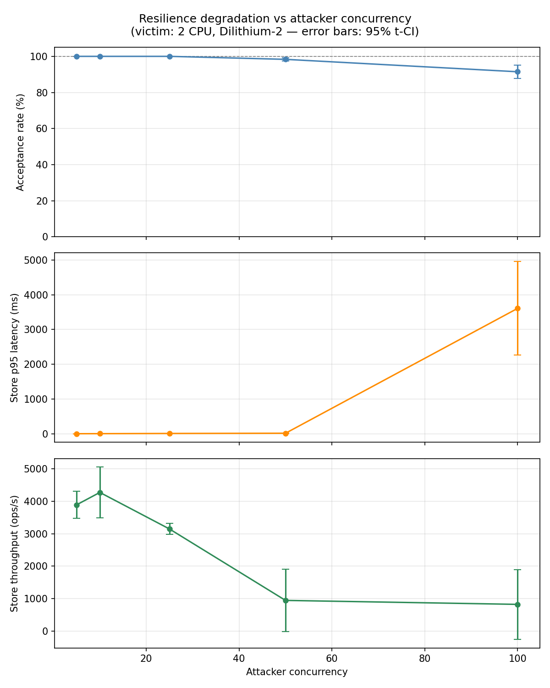

# Resilience Tests

Two complementary test scenarios measure the behaviour of an **auth-kademlia-rs**
node under adversarial load. Both run inside Docker so each node gets its own OS
process and Tokio runtime — sharing a runtime would let the attacker's overhead
directly degrade the victim's scheduler, which is not a realistic model.

---

## Infrastructure

| Container | Role | Constraints |
|-----------|------|-------------|
| `node_a` (victim) | Accepts RPCs, verifies Dilithium-2 signatures, stores DID records | **2 CPU cores, 256 MB RAM** — simulates a constrained embedded/edge node |
| `node_b` (attacker) | Generates and floods records at configurable concurrency | Unconstrained — can fully saturate node_a's CPU budget |

**Network**: isolated Docker bridge `172.21.0.0/24`.  
Node A is also exposed on host port `15900/udp` for external tooling.

**Victim signature cache** is disabled (`sig_cache = false`) so every incoming
record is verified from scratch via `spawn_blocking(Dilithium-2)` — worst-case
CPU load, no caching shortcuts.

---

## Scenario 1 — Single-run resilience test

### What it tests

A malicious node attempts to:
1. **Flood valid records** — overwhelm the victim's CPU and storage with
   authenticated DID documents signed by legitimate (but attacker-generated) keys.
2. **Inject invalid records** — send records with a tampered Dilithium-2 signature
   (one byte flipped at offset 500) to try to slip past verification under load.
3. **Verify retrieval consistency** — after the flood, check that all accepted
   records are still retrievable (no corruption, no silent data loss).

### Three sequential phases

```
Phase 1 — STORE valid   500 records   concurrency=50
Phase 2 — STORE invalid  10 records   concurrency=50
Phase 3 — GET            all accepted records
```

All records are sent **exactly once** (no cycling). Concurrency is bounded by a
semaphore so the host is never overwhelmed regardless of pool size.

### Security invariants checked

| Invariant | Pass condition |
|-----------|----------------|
| Invalid records rejected | `p2_accepted = 0` (every tampered record refused by victim) |
| Retrieval consistent | `get_miss = 0` (all accepted records retrievable after attack) |
| No crash | node_a process survives to `LIFETIME_SECS` |

### Expected degradation under load

With 50 concurrent Dilithium-2 verifications (~5 ms each) on a 2-core victim, the
OS UDP receive buffer (~208 KB ≈ 150 × 1 412 B fragments) can briefly overflow
during the initial burst of 50 × 3 = 150 fragments. This causes ~1–2 % of valid
records to be silently dropped at the kernel level — the victim never sees those
fragments, the attacker times out at 4.5 s (below the protocol's 5 s RPC timeout
so they are counted as `timeout`, not `rejected`). This is **expected graceful
degradation**, not a bug: storage on both sides stays consistent
(`victim_stored = attacker_accepted`).

### Quick start

```bash
cd resilience

# single run — watch live output
docker compose up --build

# detached + follow logs
docker compose up --build -d && docker compose logs -f node_b
```

### Output

```
[attacker] Phase 1 — STORE 500 valid records  (concurrency=50)
  accepted=493  rejected=0  timeout=7  (7.5s  66.3 ops/s)
  latency [store-valid]  min=1.2ms  avg=91.4ms  p95=18.3ms  max=4501.0ms

[attacker] Phase 2 — STORE 10 invalid records  (concurrency=50)
  accepted=0  rejected=10  timeout=0  (0.0s  2410.5 ops/s)
  latency [store-invalid]  min=1.8ms  avg=14.1ms  p95=20.2ms  max=21.0ms

[attacker] Phase 3 — GET 493 stored keys  (concurrency=50)
  hit=493  miss=0  timeout=0  (0.0s  12300.0 ops/s)

━━━ Resilience verdict ━━━━━━━━━━━━━━━━━━━━━━━━

  [✓] Security intact     all 10 tampered records rejected
  [✓] Store functional    493/500 valid records accepted
  [✓] Retrieval reliable  miss rate 0.0%

  RESULT: Node A survived — no security violations.
```

A non-zero `p2_accepted` is a **security failure** — node_b exits with code 1.

---

## Scenario 2 — Statistical analysis (N runs, t-Student CI)

`run_stats.py` automates N identical runs and computes **mean ± standard deviation
± 95 % confidence interval** (Student's t) for each performance metric. Use this
to get statistically sound measurements rather than relying on a single run.

### Metrics collected

| Metric | Description |
|--------|-------------|
| `acceptance_rate_%` | Valid records stored / sent — measures load-induced loss |
| `store_avg_ms` | Average per-record store latency (Phase 1) |
| `store_p95_ms` | 95th-percentile store latency — tail behaviour under load |
| `store_tps` | Store throughput (ops/s, Phase 1) |
| `security_%` | Fraction of invalid records correctly rejected (must be 100 %) |
| `get_miss_%` | GET miss rate after attack (must be ≈ 0 %) |
| `get_avg_ms` | Average retrieval latency (Phase 3) |
| `get_p95_ms` | 95th-percentile retrieval latency |
| `get_tps` | Retrieval throughput (ops/s, Phase 3) |

### Usage

```bash
cd resilience

# build once, then 10 runs with 95 % CI
docker compose build
python3 run_stats.py --no-build

# or: build on first run automatically
python3 run_stats.py --runs 10 --confidence 0.95

# tighter CI with more runs
python3 run_stats.py --no-build --runs 20 --confidence 0.99
```

### Example results

> Indicative measurements only — victim: 2 CPU cores / 256 MB, POOL\_SIZE=500,
> CONCURRENCY=50, sig\_cache disabled. Host: x86-64 Linux.
> Rerun `run_stats.py` on your hardware for authoritative figures.

```
Resilience benchmark — 10 runs, 95% t-Student CI

  run  1/10           … ok  accepted=496/500  store_p95=10.4ms  get_p95=5.9ms
  run  2/10           … ok  accepted=491/500  store_p95=13.4ms  get_p95=4.0ms
  run  3/10           … ok  accepted=500/500  store_p95=14.6ms  get_p95=3.6ms
  run  4/10           … ok  accepted=481/500  store_p95= 6.7ms  get_p95=4.0ms
  run  5/10           … ok  accepted=492/500  store_p95=15.2ms  get_p95=3.9ms
  run  6/10           … ok  accepted=500/500  store_p95=12.7ms  get_p95=4.1ms
  run  7/10           … ok  accepted=494/500  store_p95=11.4ms  get_p95=3.9ms
  run  8/10           … ok  accepted=489/500  store_p95=12.8ms  get_p95=3.8ms
  run  9/10           … ok  accepted=488/500  store_p95=12.9ms  get_p95=3.7ms
  run 10/10           … ok  accepted=486/500  store_p95=11.5ms  get_p95=3.5ms

Results (10/10 successful runs):

Metric                              Mean         Std        CI lo        CI hi  (95% t-CI)
──────────────────────────────────────────────────────────────────────────────────────────
acceptance_rate_%                 98.340       1.211       97.474       99.206
store_avg_ms                      83.158      53.831       44.649      121.666
store_p95_ms                      12.162       2.395       10.449       13.875
store_tps                       1225.778    2379.273     -476.252     2927.807
security_%                       100.000       0.000      100.000      100.000
get_miss_%                         0.000       0.000        0.000        0.000
get_avg_ms                         2.506       0.549        2.114        2.899
get_p95_ms                         4.047       0.672        3.567        4.528
get_tps                        18850.615    4052.810    15951.409    21749.821
```

**Reading the results:**

- **`acceptance_rate_%`** — 98.34 % mean: ~1–2 % of valid records lost per run due
  to brief OS UDP buffer saturation during the initial 50-record burst. Expected
  graceful degradation; security is unaffected.
- **`store_tps` high variance** — bimodal distribution: runs with zero UDP timeouts
  complete Phase 1 in ~0.1 s (≈ 4 000–6 000 ops/s), runs with timeouts are bounded
  by the 4.5 s RPC timeout window (≈ 111 ops/s). The wide CI reflects this
  run-to-run variability, not measurement error.
- **`security_%` = 100 % ± 0** — every tampered record was rejected in all 10 runs,
  even under CPU saturation. Zero variance.
- **`get_miss_%` = 0 % ± 0** — perfect retrieval consistency: all accepted records
  remained retrievable after the attack in every run.

Raw data saved to `resilience/stats.json`.

---

## Scenario 3 — Degradation sweep (concurrency vs performance)

`degradation_sweep.py` sweeps the attacker's concurrency from low to high and
plots how the victim's acceptance rate, tail latency and throughput degrade.
This gives a **degradation curve** that characterises the node's behaviour across
the full range of attack intensities.

### What varies

- **x-axis**: attacker concurrency (number of in-flight RPCs) — from benign
  (5–10) through moderate (20–30) to saturating (50–100).
- **y-axis**: three metrics — acceptance rate (%), store p95 latency (ms), store
  throughput (ops/s).

Each concurrency level is run multiple times; the curve shows mean ± t-CI error
bars.

### Usage

```bash
cd resilience

# default sweep: [5,10,20,30,50,75,100], 3 runs each
python3 degradation_sweep.py --no-build

# custom levels, 5 runs each for tighter CI
python3 degradation_sweep.py --levels 5 10 20 30 50 75 100 --runs 10 --no-build

# first run builds the images
python3 degradation_sweep.py --runs 3
```

Requires `matplotlib` for the plot (`pip install matplotlib`).
Without it the data is still saved to `resilience/degradation.json`.

### Example results

> Indicative measurements only — victim: 2 CPU cores / 256 MB, POOL\_SIZE=500,
> sig\_cache disabled, 10 runs per level, 95 % t-CI. Host: x86-64 Linux.

| Concurrency | Acceptance (%) | Store p95 (ms) | Store tps (ops/s) |
|:-----------:|:--------------:|:--------------:|:-----------------:|
| 5  | **100.00** ± 0.00 |    1.64 ± 0.02 | 3 890 ± 413 |
| 10 | **100.00** ± 0.00 |    3.07 ± 0.38 | 4 271 ± 780 |
| 25 | **100.00** ± 0.00 |    8.85 ± 0.38 | 3 145 ± 168 |
| 50 |   98.34  ± 0.91  |   15.39 ± 1.81 |   945 ± 962 |
| 100|   91.46  ± 3.60  | 3 607.66 ± 1 347.85 | 823 ± 1 076 |



**Reading the curve:**

- **Concurrency ≤ 25** — victim keeps up with all requests. Acceptance rate is
  100 % in every run (zero variance). p95 latency grows linearly with concurrency
  (~1.6 ms → 8.9 ms) as the blocking thread pool queue fills proportionally.
  Throughput is stable around 3 000–4 000 ops/s.

- **Concurrency = 50 — saturation threshold** — OS UDP receive buffer briefly
  overflows during the initial burst (50 × 3 fragments ≈ 150 datagrams, close to
  the ~150-datagram kernel buffer limit). Acceptance drops to 98.34 %; p95 rises to
  15.4 ms; throughput falls and becomes bimodal (runs with/without timeouts diverge),
  hence the large CI.

- **Concurrency = 100 — severe degradation** — the majority of records hit the
  4.5 s RPC timeout. Acceptance falls to 91.46 %; p95 spikes to 3 607 ms (nearly
  all records waiting for a timeout slot); throughput variance is extreme (CI half
  ≈ 1 076 ops/s). Security remains intact: 0 invalid records accepted in all runs.

### Output files

| File | Contents |
|------|----------|
| `degradation.json` | Raw per-run data + per-level stats (mean, std, CI) |
| `degradation.png` | Three-panel degradation plot with error bars |

### Interpreting the curve

- **Acceptance rate**: stays near 100 % at low concurrency; drops when the UDP
  receive buffer saturates (~150 concurrent fragments on a 2-core node).
- **p95 latency**: flat at low concurrency (victim keeps up); spikes when the
  blocking thread pool queue builds up.
- **Throughput**: rises with concurrency up to the victim's CPU ceiling, then
  plateaus or drops as timeouts increase.

The point where acceptance rate starts falling and p95 spikes identifies the
**saturation threshold** of the victim configuration.

---

## Environment variables

### node_a (victim)

| Variable | Default | Effect |
|----------|---------|--------|
| `NODE_PORT` | 5678 | UDP listen port |
| `SEED_COUNT` | 5 | Records pre-seeded at startup |
| `LIFETIME_SECS` | 300 | Auto-shutdown after N seconds |
| `RUST_LOG` | warn | Log verbosity |

### node_b (attacker)

| Variable | Default | Effect |
|----------|---------|--------|
| `TARGET_ADDR` | 172.21.0.10:5678 | Victim address |
| `ATTACKER_PORT` | 5679 | Attacker's own UDP port |
| `POOL_SIZE` | 500 | Valid records to generate (invalid pool = max(POOL_SIZE/50, 10)) |
| `CONCURRENCY` | 50 | Max in-flight RPCs — overridden per-level by `degradation_sweep.py` |
| `RUST_LOG` | warn | Log verbosity |

---

## Port allocation

| Port | Usage |
|------|-------|
| `172.21.0.10:5678` | node_a internal |
| `172.21.0.11:5679` | node_b internal |
| `0.0.0.0:15900/udp` | node_a exposed to host |

No conflict with the root `docker-compose.yaml` (demo), which uses subnet `172.20.0.0/24`.
